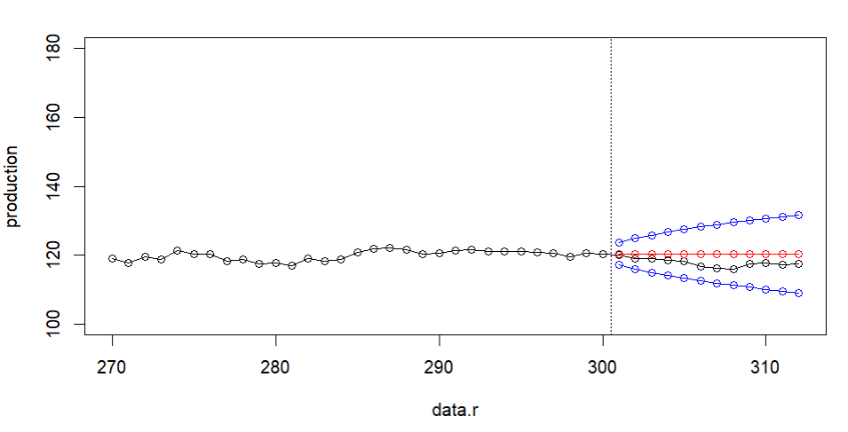
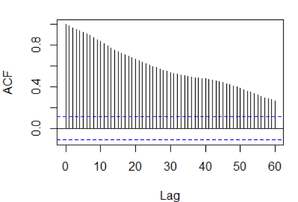
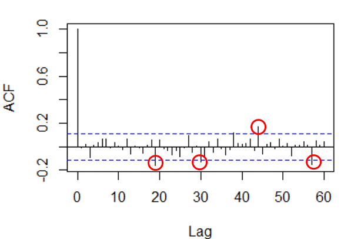
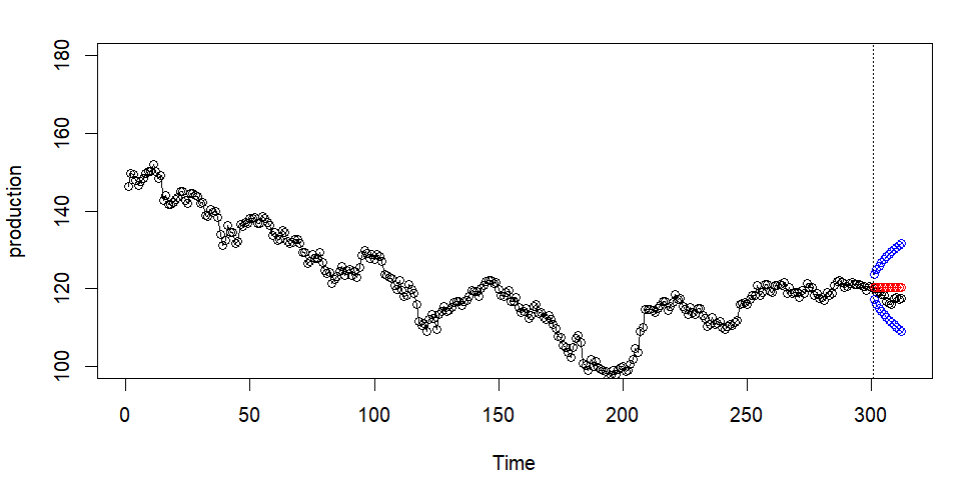

# Forecasting the 0050 ETF with SARIMA (R)

Time-series forecasting of the **Yuanta Taiwan Top 50 ETF (0050.TW)** daily closing price using a seasonal ARIMA model in R. Course project, Time Series Analysis, Tamkang University (Dept. of Statistics), 2023.

**Tools:** R (`stats::arima`, `tseries`) · ACF/PACF · unit-root tests (DF / ADF / PP) · Ljung-Box · AIC/BIC model selection

## Summary

| | |
|---|---|
| Data | Daily closes, 2022-01-03 – 2023-05-04, from the Taiwan Stock Exchange (312 rows in the original report; 320 in `data/`, see `data/README.md`) |
| Split | 300 days train / 12 days holdout |
| Seasonal period | 5 (one trading week) |
| Selected model | **ARIMA(0,1,0)(0,0,1)[5]** — AIC 1141.07, BIC 1148.47 |
| Result | All 12 held-out prices fall inside the 95% forecast interval |



## Method

**1. Stationarity check.** The raw series trends and its ACF decays very slowly. Three unit-root tests agree it is non-stationary (H0: unit root).

| Test | Raw series | After 1st difference |
|---|---|---|
| Dickey–Fuller | 0.8565 | 0.01 |
| Augmented Dickey–Fuller | 0.7635 | 0.01 |
| Phillips–Perron | 0.8801 | 0.01 |

One regular difference (d = 1) is enough; no seasonal differencing was needed (D = 0).

<p float="left">
  
  
</p>

**2. Order identification.** After differencing, both the ACF and PACF show a significant spike around lag 20, so the non-seasonal orders were fixed at p = q = 0 and the seasonal orders searched over P ≤ 4, Q ≤ 4 with period 5.

**3. Candidate models.** Two models came out on top of the search:

| Model | Residuals white noise (Ljung-Box, lag 20) | AIC | BIC | # params |
|---|---|---|---|---|
| ARIMA(0,1,0)(2,0,4)[5] | Yes (p = 0.40) | **1140.547** | 1166.45 | 6 |
| ARIMA(0,1,0)(0,0,1)[5] | Yes (p = 0.43) | 1141.072 | **1148.473** | 1 |

The AIC difference is negligible (0.5) while the simpler model has one parameter instead of six, so **ARIMA(0,1,0)(0,0,1)[5]** was chosen (sma1 = 0.040).

**4. Forecast.** 12-step-ahead forecast on the holdout window. Actual values (black) all fall within the 95% interval (blue) around the forecast (red).



## Takeaways

- With d = 1 and a single, tiny seasonal MA term (0.04), the selected model is essentially a random walk — consistent with the view that daily ETF prices are close to unpredictable in the short run. The forecast is a near-flat line with a widening interval.
- The practical conclusion of the report: short-term price prediction offers little edge, which supports a dollar-cost-averaging, long-horizon approach to an index ETF like 0050 rather than timing entries.

## Limitations / what I'd do differently now

- Unit-root tests were run on `log(price)` while the ARIMA was fit on the raw price; both should use the same transformation.
- "Within the 95% interval" is a weak check on 12 points. A proper evaluation would report RMSE/MAE on the holdout and compare against a naive (random-walk) baseline.
- Seasonal orders were chosen by manual search; `forecast::auto.arima()` or a rolling-origin cross-validation would be more systematic.
- Only ~1.3 years of data; a longer window and a log-return formulation would be more standard for financial series.

## Repository layout

```
├── get_data.R         # downloads 0050 closes from the TWSE API -> data/0050.dat
├── 0050_sarima.R      # full analysis script (cleaned and commented)
├── data/              # 0050.csv / 0050.dat (daily closes) + README
└── figures/           # plots exported from the report
```

To reproduce: `Rscript 0050_sarima.R` (data is included; `Rscript get_data.R` re-downloads it from TWSE).

---

## 中文摘要

以 R 對元大台灣 50（0050）2022/01/03–2023/05/04 共 312 筆日收盤價建立 SARIMA 模型。原始資料經 DF / ADF / PP 三種單根檢定均不平穩（p > 0.05），一階差分後轉為平穩（p = 0.01）。以週期 5（一週五個交易日）搜尋季節性階數，在殘差通過 Ljung-Box 白噪音檢定的模型中比較 AIC 與 BIC，最終選擇參數最少的 **ARIMA(0,1,0)(0,0,1)[5]**。以前 300 筆訓練、後 12 筆驗證，實際值全數落在 95% 預測區間內。結論：短期股價難以預測，建議以定期定額方式長期投資。

課程專題（淡江大學統計系時間序列分析，2023）。
